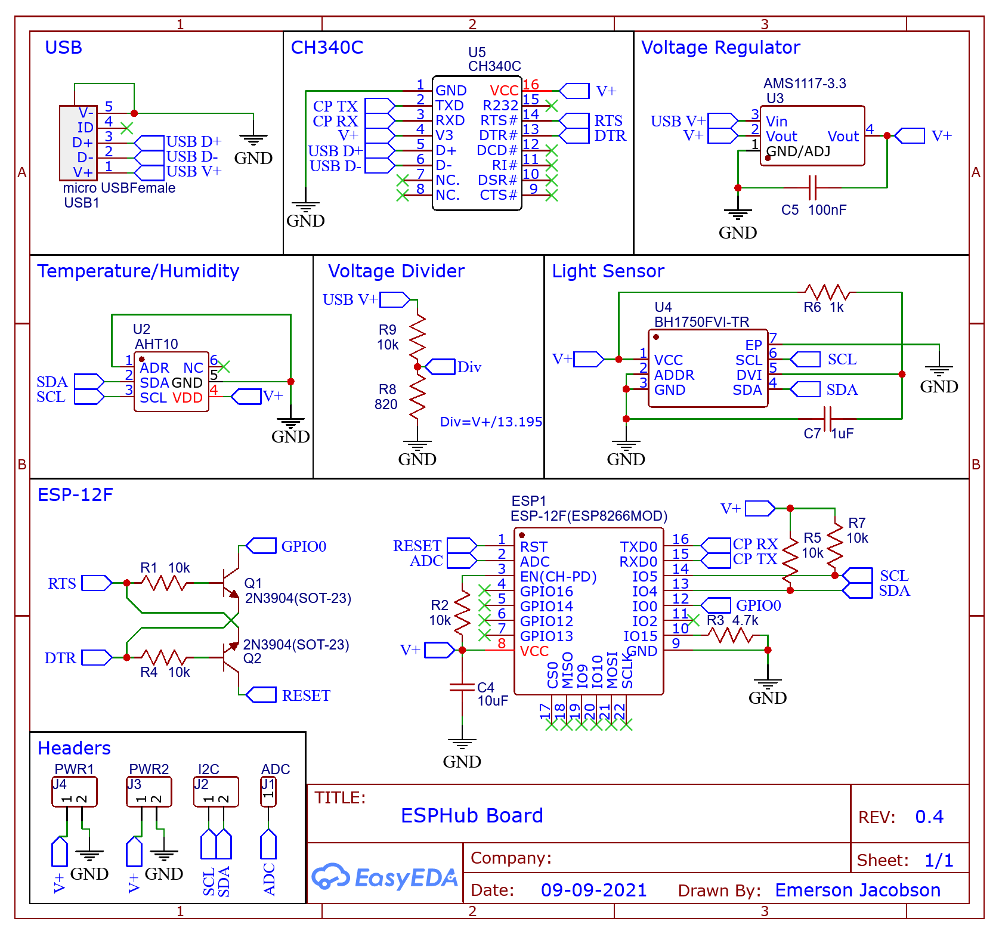
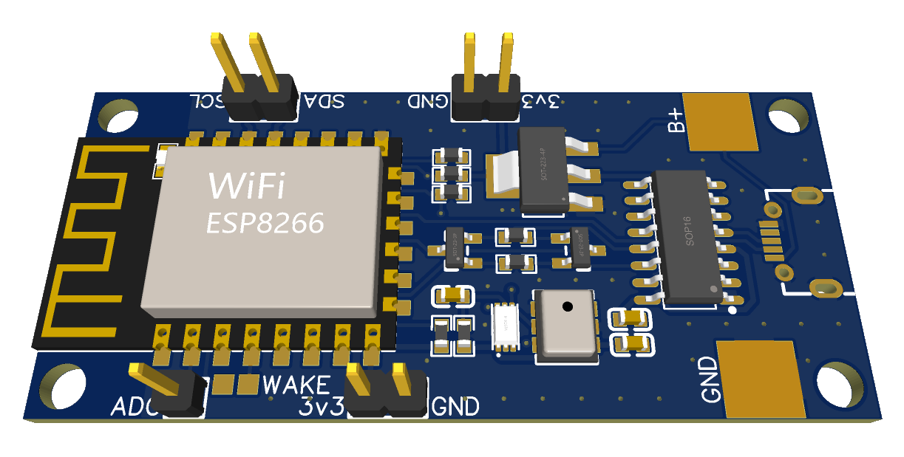

# ESPHub Hardware

This is the hardware component of my [ESPHub](https://github.com/emwjacobson/ESPHub) project. I started the software project with the intent to create a PCB that held a few different sensors that can easily be tied into Home Assistant. I came up with 2 modules that supply 3 different sensors:

- AHT10 - Temperature and Humidity
- BH1750 - Lux (Brightness)

I also wanted the hardware to be able to be used with [ESPHome](https://esphome.io/) as that is a well established project.

This project was made using [EasyEDA](https://easyeda.com/) and is made publically available [here](https://oshwlab.com/emwjacobson/esp-12f-ch340) on the Open Source Hardware Lab's website.

As I make updates I will post the BOM, Pick and Place, and Gerber files on the [Releases](https://github.com/emwjacobson/ESPHub-Hardware/releases) page.

# Pads and Headers

## Headers

On the board there are two areas where 3.3v power is broken out. The power and ground headers are labeled with "3v3" and "GND" respectively. These are meant to be output power as they branch off of the voltage regulator, though in theory they can also power the device if a 3.3v input is supplied.

The I2C's SDA and SCL pins of the ESP8266 are broken out to allow for connecting to other I2C devices.

The ESP8266 has a single Analog pin that is broken out on the header labeled ADC. This can be useful for adding a device such as a potentiometer. **Note** that this pin can be used with the voltage divider (labeled vDiv and explained more below) to monitor the input voltage of the device. In this case, the voltage divider uses the ADC pin and another analog device should not be used.

## Pads

The pads labeled "vDiv" connects the integrated voltage divider to the Analog pin of the ESP8266. If these solder pads are bridged, then another analog device cannot be connected to the ADC pin. The voltage divider maps 0-13.195v to 0-1v. This was intended to measure battery level if the device is powered through V+/GND pins (explained more below).

The large V+ and GND pads are intended to be used if the device is being powered through an external source such as a battery. The V+ pad is connected to the input of the voltage regulator, the USB V+, and voltage divider. **Note**: Do not connect the micro-USB port and power the V+ pad at the same time. They are directly connected to eachother and a difference in voltage might cause harm to either power source. The voltage regulator supports voltages from 4.8v up to 15v and the voltage divider can measure from 0v to 13.195v.

The pads labeled WAKE connect the Wake and Reset pins of the ESP8266. Bridging these allows the device to wake up from it's Deep Sleep mode. Without these pins bridges, the device will not be able to wake itself and will need to be power cycled in order to return to normal operation.

# Schematic

# 3D Model

