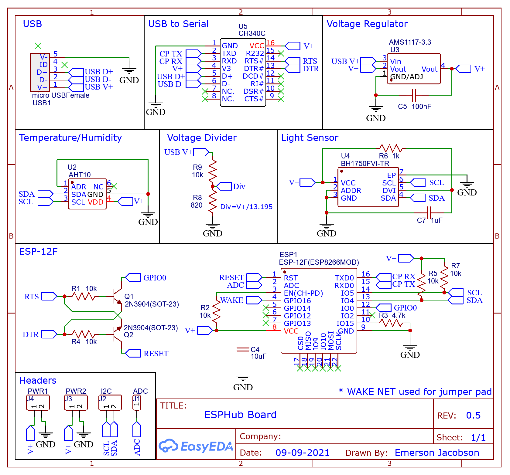
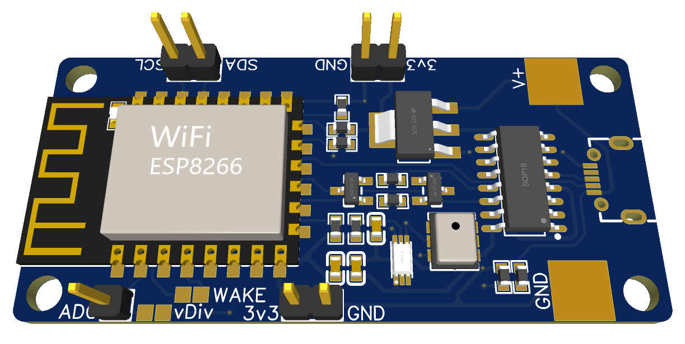

# ESPHub Hardware

This is the hardware component of my [ESPHub](https://github.com/emwjacobson/ESPHub) project. I started the software project with the intent to create a PCB that held a few different sensors that can easily be tied into Home Assistant. I came up with 2 modules that supply 3 different sensors:

- AHT10 - Temperature and Humidity
- BH1750 - Lux (Brightness)

As of v0.2, the sensor is made with room for headers for the I2C interface as well as the ADC pin on the ESP8266. It also has pads that can be soldered together to allow for the Deep Sleep wake functionality.

I also wanted the hardware to be able to be used with [ESPHome](https://esphome.io/) as that is a well established project.

This project was made using [EasyEDA](https://easyeda.com/) and is made publically available [here](https://oshwlab.com/emwjacobson/esp-12f-ch340) on the Open Source Hardware Lab's website.

As I make updates I will post the Archive of the Gerber files on the [Releases](https://github.com/emwjacobson/ESPHub-Hardware/releases) page.

# Schematic

# 3D Rendering

